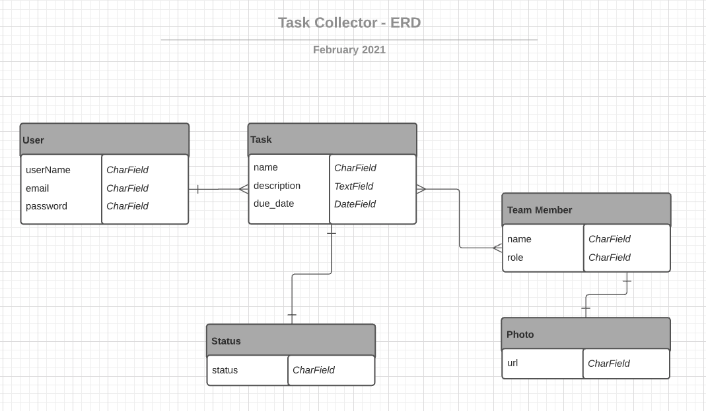
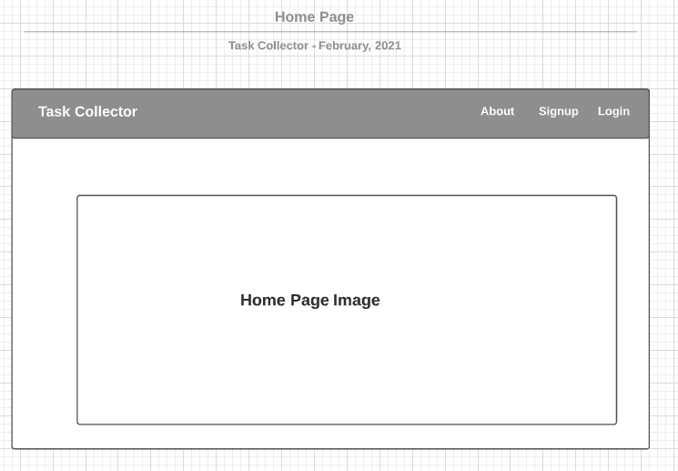
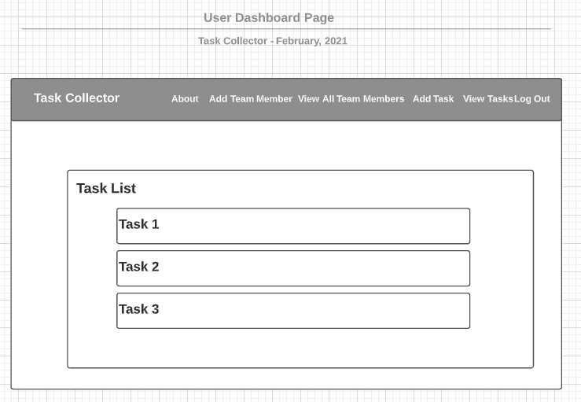
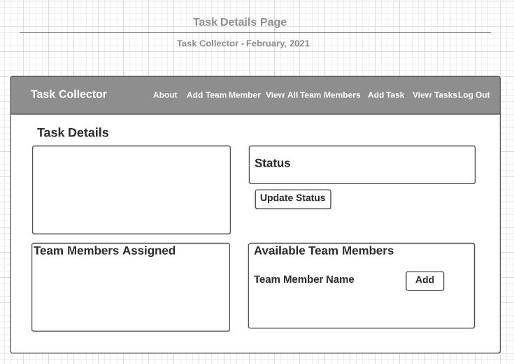

## About This App
Task Collector is a project management tool designed for Project Managers to keep track of assigned tasks and team member workload.  PMs will be able to create a task, create team members, assign team members to tasks and track status of each task (Unassigned, Assigned - Not completed and Completed).
 
## ERD

This is the Entity Relationship Diagram for the app.  One user can have many tasks.  Task can have one status.  The Task and Team Member entities have a Many to many relationship.  Finally, Team Member and Photo (of team member) have a One to One relationship

## Wireframes

 

## Technologies Used
* Django
* Python
* PostgreSQL
* CSS3  
* JQuery v3.5  
* Materialize  
 

## Getting Started
Click [here](https://taskcollector.herokuapp.com/) to open site. 
 

## Future Enhancements
- [] Create usergroups that can see the same tasks
- [] Allow project manager to send invites for team members to sign up for app
 
 
